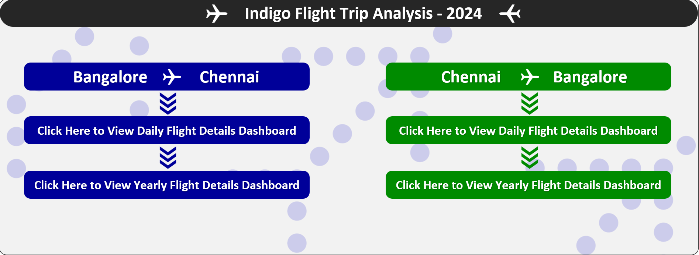
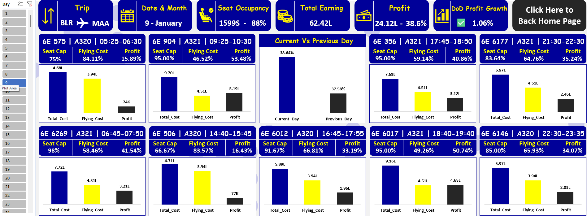

# Chennai_To_Bangalore_And_Bangalore_To_Chennai_Indigo_Flight_Trip_Analysis_Using_Excel
## 🌐 Live Dashboard

- Click Here to View Live Dashboard: [https://1drv.ms/x/c/ce8ecb681701e875/IQBpNOOtBSBJQ4d-g43e_iCOAQGC1D3gB3NrlRapIyQ5HDw?e=JZ0Xhf]

---

## 📌 Project Overview
- Tool Used: *Microsoft Excel*
- Domain: *Indigo Flight Trip Analysis*
- Duration: *4 Days*
- Objective: *To analyse the flight trips between*
  - Bangalore (BLR) → Chennai (MSS)
  - Chennai (MSS) → Bangalore (BLR)

covering Passenger Seat Occupancy, Total Earnings, Flight Operational Cost, and Profit.

---

## ✈️ Bangalore (BLR) → Chennai (MSS)
The trip details were analysed in two main parts:
- Day-wise Trip Analysis
- Flight-wise Trip Analysis

### 🗓️ Day-wise Trip Analysis

### 📊 Analysis:
- 9 daily flights (1 hr 5 min) operated throughout 2024, totalling 3,294 trips.
- Total Passengers: 5.9L
- Earnings: ₹228 Cr
- Operational Cost: ₹143 Cr (63%)
- Profit: ₹85 Cr (37%)

### ➗ Daily Averages:
- Passenger Load: 88.6%
- Earnings: ₹62.4L
- Cost: ₹39.3L
- Profit: ₹23.1L

### 📈 Trends & Insights:
- Weekend Impact: Friday–Sunday contributed 44% of total profit.
- Weekly Trend: Weeks 2–4 generated 70% of total profit.
- Monthly Trend: October, April, and January were the most profitable months (within 0.25% variation).

### 🎯 Conclusion:
- The year 2024 was highly profitable with consistent monthly performance.
- The BLR–MSS route alone contributed 37% of annual profit.
- Increasing flight frequency and leveraging weekend/holiday demand can further boost revenue.

