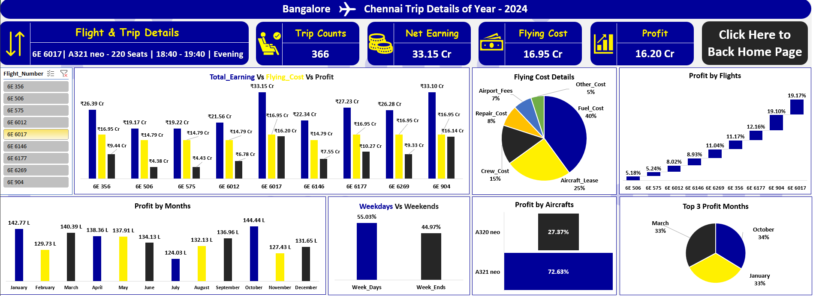
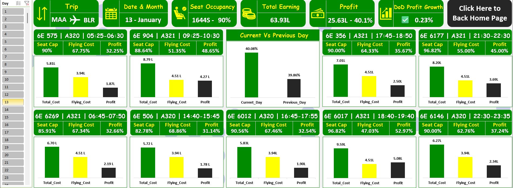
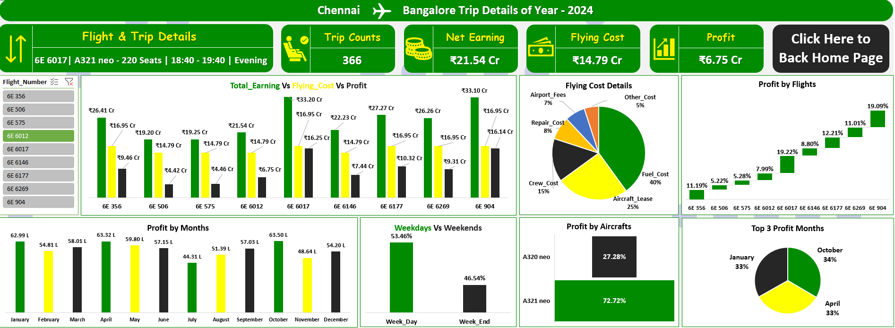

# Chennai_To_Bangalore_And_Bangalore_To_Chennai_Indigo_Flight_Trip_Analysis_Using_Excel
## 🌐 Live Dashboard

- Click Here to View Live Dashboard: [https://1drv.ms/x/c/ce8ecb681701e875/IQBpNOOtBSBJQ4d-g43e_iCOAQGC1D3gB3NrlRapIyQ5HDw?e=JZ0Xhf]

---

## 📌 Project Overview
- Tool Used: *Microsoft Excel*
- Domain: *Indigo Flight Trip Analysis*
- Duration: *4 Days*
- Objective: *To analyse the flight trips between*
  - Bangalore (BLR) → Chennai (MSS)
    - Day-wise Trip Analysis
    - Flight-wise Trip Analysis
  - Chennai (MSS) → Bangalore (BLR)
    - Day-wise Trip Analysis
    - Flight-wise Trip Analysis
      
covering Passenger Seat Occupancy, Total Earnings, Flight Operational Cost, and Profit.

---

## ✈️ Bangalore (BLR) → Chennai (MSS)
The trip details were analysed in two main parts:
- Day-wise Trip Analysis
- Flight-wise Trip Analysis

### 🗓️ Day-wise Trip Analysis

### 📊 Analysis:
- 9 daily flights (1 hr 5 min) operated throughout 2024, totalling 3,294 trips.
- Total Passengers: 5.9L
- Earnings: ₹228 Cr
- Operational Cost: ₹143 Cr (63%)
- Profit: ₹85 Cr (37%)

### ➗ Daily Averages:
- Passenger Load: 88.6%
- Earnings: ₹62.4L
- Cost: ₹39.3L
- Profit: ₹23.1L

### 📈 Trends & Insights:
- Weekend Impact: Friday–Sunday contributed 44% of total profit.
- Weekly Trend: Weeks 2–4 generated 70% of total profit.
- Monthly Trend: October, April, and January were the most profitable months (within 0.25% variation).

### 🎯 Conclusion:
- The year 2024 was highly profitable with consistent monthly performance.
- The BLR–MSS route alone contributed 37% of annual profit.
- Increasing flight frequency and leveraging weekend/holiday demand can further boost revenue.

---

### 🛫 Flight-wise Trip Analysis
Aircraft Types Operated:
- A320neo (180 Seats)
- A321neo (220 Seats)

### 💺 A320neo (180 Seats) – Aircraft Analysis:

- Flight No: 6E 575,	Schedule: 05:25–06:30 (Midnight),	Total Passengers: 54K,	Earnings (₹ Cr): 19.22,	Cost (₹ Cr): 14.79,	Profit (₹ Cr): 4.43,	Load (%): 82%,	Profit Margin: 23%
- Flight No: 6E 506,	Schedule: 14:40–15:45 (Afternoon),	Total Passengers: 49K,	Earnings (₹ Cr): 19.17,	Cost (₹ Cr): 14.79,	Profit (₹ Cr): 4.38,	Load (%): 76%,	Profit Margin: 23%
- Flight No: 6E 6012,	Schedule: 16:45–17:55 (Evening),	Total Passengers: 60K,	Earnings (₹ Cr): 21.56,	Cost (₹ Cr): 14.79,	Profit (₹ Cr): 6.78,	Load (%): 92%,	Profit Margin: 32%
- Flight No: 6E 6146,	Schedule: 22:30–23:35 (Night),	Total Passengers: 57K,	Earnings (₹ Cr): 22.34,	Cost (₹ Cr): 14.79,	Profit (₹ Cr): 7.55,	Load (%): 88%,	Profit Margin: 34%

### 📈 Insights:
- A320neo flights mainly operate during leisure hours (midnight, afternoon, and late evening).
- These flights contribute 28% of total profit, often serving connecting passengers.

### 💺 A321neo (220 Seats) – Aircraft Analysis:

- Flight No: 6E 6269,	Schedule: 06:45–07:50 (Morning),	Total Passengers: 73K,	Earnings (₹ Cr): 26.28,	Cost (₹ Cr): 16.95,	Profit (₹ Cr): 9.33,	Load (%): 92%,	Profit Margin: 35%
- Flight No: 6E 904,	Schedule: 09:25–10:25 (Morning),	Total Passengers: 73K,	Earnings (₹ Cr): 33.10,	Cost (₹ Cr): 16.95,	Profit (₹ Cr): 16.14,	Load (%): 92%,	Profit Margin: 49%
- Flight No: 6E 356,	Schedule: 17:45–18:50 (Evening),	Total Passengers: 74K,	Earnings (₹ Cr): 26.39,	Cost (₹ Cr): 16.95,	Profit (₹ Cr): 9.44,	Load (%): 92%,	Profit Margin: 36%
- Flight No: 6E 6017,	Schedule: 18:40–19:40 (Evening),	Total Passengers: 74K,	Earnings (₹ Cr): 33.15,	Cost (₹ Cr): 16.95,	Profit (₹ Cr): 16.20,	Load (%): 92%,	Profit Margin: 49%
- Flight No: 6E 6177,	Schedule: 21:30–22:30 (Night),	  Total Passengers: 71K,	Earnings (₹ Cr): 27.23,	Cost (₹ Cr): 16.95,	Profit (₹ Cr): 10.27,	Load (%): 88%,	Profit Margin: 38%

### 📈 Insights:
- A321neo flights, operating mostly during business hours, deliver 72% of total profit.
- Top-performing flights: 6E 904 (09:25) and 6E 6017 (18:40) show the highest profit margins.
- Adding more flights between 06:45–09:25 (morning) and 18:40–21:30 (evening) could improve profitability.

---

## ✈️ Chennai (MSS) →  Bangalore (BLR)
The trip details were analysed in two main parts:
- Day-wise Trip Analysis
- Flight-wise Trip Analysis

### 🗓️ Day-wise Trip Analysis

### 📊 Analysis:
- 9 daily flights (1 hr 5 min) operated throughout 2024, totalling 3,294 trips.
- Total Passengers: 5.9L
- Earnings: ₹228 Cr
- Operational Cost: ₹143 Cr (63%)
- Profit: ₹85 Cr (37%)

### ➗ Daily Averages:
- Passenger Load: 88.5%
- Earnings: ₹62.4L
- Cost: ₹39.3L
- Profit: ₹23.1L

### 📈 Trends & Insights:
- Weekend Impact: Friday–Sunday contributed 46% of total profit.
- Weekly Trend: Weeks 2–4 generated 96% of total profit.
- Monthly Trend: October, April, and January were the most profitable months (within 0.25% variation).

### 🎯 Conclusion:
- The MSS–BLR route showed strong profitability and consistent performance across months.
- This route contributed 37% of total annual profit.
- Increasing frequency and leveraging weekend/holiday travel can further improve revenue potential.

---

### 🛫 Flight-wise Trip Analysis
Aircraft Types Operated:
- A320neo (180 Seats)
- A321neo (220 Seats)

### 💺 A320neo (180 Seats) – Aircraft Analysis:

- Flight No: 6E 575,	Schedule: 05:25–06:30 (Midnight),	Total Passengers: 54K,	Earnings (₹ Cr): 19.25,	Cost (₹ Cr): 14.79,	Profit (₹ Cr): 4.46,	Load (%): 82%,	Profit Margin: 23%
- Flight No: 6E 506,	Schedule: 14:40–15:45 (Afternoon),	Total Passengers: 49K,	Earnings (₹ Cr): 19.20,	Cost (₹ Cr): 14.79,	Profit (₹ Cr): 4.42,	Load (%): 76%,	Profit Margin: 23%
- Flight No: 6E 6012,	Schedule: 16:45–17:55 (Evening),	Total Passengers: 60K,	Earnings (₹ Cr): 21.54,	Cost (₹ Cr): 14.79,	Profit (₹ Cr): 6.75,	Load (%): 92%,	Profit Margin: 32%
- Flight No: 6E 6146,	Schedule: 22:30–23:35 (Night),	Total Passengers: 57K,	Earnings (₹ Cr): 22.23,	Cost (₹ Cr): 14.79,	Profit (₹ Cr): 7.44,	Load (%): 88%,	Profit Margin: 34%

### 💺 A321neo (220 Seats) – Aircraft Analysis:

- Flight No: 6E 6269,	Schedule: 06:45–07:50 (Morning),	Total Passengers: 73K,	Earnings (₹ Cr): 26.26,	Cost (₹ Cr): 16.95,	Profit (₹ Cr): 9.31,	Load (%): 92%,	Profit Margin: 35%
- Flight No: 6E 904,	Schedule: 09:25–10:25 (Morning),	Total Passengers: 73K,	Earnings (₹ Cr): 33.10,	Cost (₹ Cr): 16.95,	Profit (₹ Cr): 16.14,	Load (%): 92%,	Profit Margin: 49%
- Flight No: 6E 356,	Schedule: 17:45–18:50 (Evening),	Total Passengers: 74K,	Earnings (₹ Cr): 26.41,	Cost (₹ Cr): 16.95,	Profit (₹ Cr): 9.46,	Load (%): 92%,	Profit Margin: 36%
- Flight No: 6E 6017,	Schedule: 18:40–19:40 (Evening),	Total Passengers: 74K,	Earnings (₹ Cr): 33.20,	Cost (₹ Cr): 16.95,	Profit (₹ Cr): 16.25,	Load (%): 92%,	Profit Margin: 49%
- Flight No: 6E 6177,	Schedule: 21:30–22:30 (Night),	  Total Passengers: 71K,	Earnings (₹ Cr): 27.27,	Cost (₹ Cr): 16.95,	Profit (₹ Cr): 10.32,	Load (%): 88%,	Profit Margin: 38%

### 📈 Insights:
- The A321neo aircraft again dominated profits, especially during business hours.
- A320neo aircraft served connecting or low-demand hours efficiently.
- Highest-profit flights: 6E 904 (09:25) and 6E 6017 (18:40) maintained consistent performance across both routes.
- Increasing capacity in morning and evening time slots could further enhance profitability.

### 🧠 Final Conclusion:
Two aircraft types — A320neo (180 seats) and A321neo (220 seats) — operate on both routes with distinct performance characteristics.
- •	A320neo flights: Operate mainly during off-peak or leisure hours, contributing 28% of total profit.
- •	A321neo flights: Operate during high-demand business hours, contributing 72% of total profit.
Overall, 2024 was a highly profitable year for both routes, showing strong load factors, stable revenue trends, and clear growth potential.
